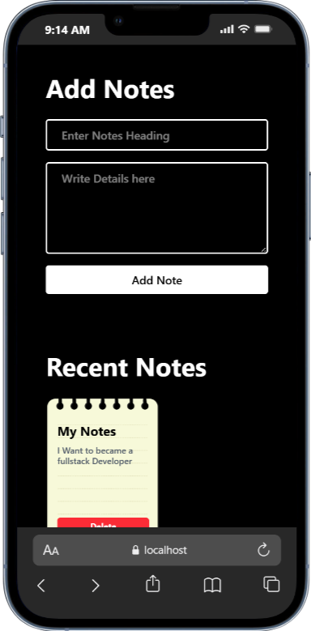

# Notes Application 📝

A sleek and modern notes application built with React and Tailwind CSS, featuring a beautiful dark theme and responsive design for all devices.

## 📱 Responsive Design Showcase

### Desktop View

.png>)
_Elegant desktop interface with side-by-side layout for efficient note-taking_

### Tablet View

.png>)
_Optimized layout for tablet users with perfect balance of form and function_

### Mobile View


_Streamlined mobile experience for on-the-go note-taking_

## 🌟 Key Features

- **Dark Theme Design**

  - Eye-friendly dark mode with purple accents
  - Smooth transitions and hover effects
  - Modern and sleek user interface

- **Responsive Layout**

  - Adapts seamlessly to all screen sizes
  - Optimized for desktop, tablet, and mobile devices
  - Consistent user experience across platforms

- **Note Management**
  - Create notes with title and content
  - Real-time updates
  - Clean and intuitive interface
  - Instant note display after creation

## 🛠️ Technologies Used

- **Frontend Framework**

  - React.js
  - Vite for fast development and building

- **Styling**
  - Tailwind CSS for modern, utility-first styling
  - Custom dark theme implementation
  - Responsive design principles

## 📦 Installation and Setup

1. **Clone the Repository**

```bash
git clone https://github.com/haseebjaved4212/Notes-Application.git
```

2. **Navigate to Project Directory**

```bash
cd Notes-Application
```

3. **Install Dependencies**

```bash
npm install
```

4. **Start Development Server**

```bash
npm run dev
```

5. **Build for Production**

```bash
npm run build
```

## 💻 Usage

1. **Creating a Note**

   - Enter a title in the "Note Title" field
   - Add your note content in the textarea
   - Click "Add Note" to save

2. **Viewing Notes**
   - Notes appear in the right panel (desktop) or below (mobile)
   - Each note displays in a card format
   - Responsive grid layout adjusts based on screen size

## 🎨 Design Features

- **Color Scheme**

  - Dark background for reduced eye strain
  - Purple accents for visual hierarchy
  - Consistent color palette throughout

- **UI Components**
  - Custom styled input fields
  - Responsive cards for notes
  - Modern button design
  - Smooth transitions

## 🤝 Contributing

Contributions are always welcome! Here's how you can help:

1. Fork the repository
2. Create your feature branch (`git checkout -b feature/AmazingFeature`)
3. Commit your changes (`git commit -m 'Add some AmazingFeature'`)
4. Push to the branch (`git push origin feature/AmazingFeature`)
5. Open a Pull Request

## 📝 License

This project is licensed under the MIT License - see the [LICENSE](LICENSE) file for details.

## 👨‍💻 Author

**Haseeb Javed**

- GitHub: [@haseebjaved4212](https://github.com/haseebjaved4212)

## 🙏 Acknowledgments

- Thanks to React.js and Tailwind CSS communities
- Inspired by modern note-taking applications
- Special thanks to all contributors

---

⭐ Star this repository if you find it helpful!
